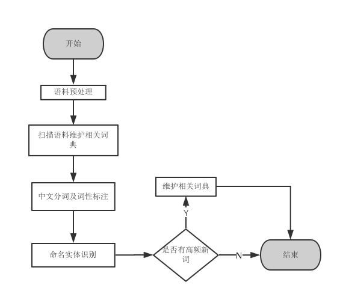

# 面向微博语料的中文词法分析技术

## 一、立项依据

### 1、项目来源

本项目来源于对“大数据”时代互联网海量文本语料资源进行有效利用的需求，研究海量语料资源条件下的微博语料的中文词法分析问题。中文词法分析主要包括中文分词、词性标注和命名实体识别任务，而微博语料的中文分词和词性标注问题是近年来的研究热点，也是当前工业界亟待解决和应用的热点问题。面向微博语料的中文词法分析技术，是工业界很多基于微博的项目（如突发事件检测，事件追踪，舆情分析）的基础，因为中文语料的特殊性，大多是中文自然语言处理任务都必须建立在已分词（词性标注）文本的基础上才能完成。因此，项目的完成将有助于推动互联网相关自然语言处理任务的研究，具有重要的理论意义和应用价值。

### 2、项目研究意义

随着计算机与网络技术的发展，网络社交媒体（social media）不断壮大，并且用户数目不断增多，每时每刻都有数量庞大的信息在网络上产生、传播。微博（Weibo, MicroBlog）是一个基于用户关系的信息平台，用户通过建立关注、被关注、相互关注，可以轻松获取、分享和转发微博平台上海量的微信息。这一切通过操作手机或使用浏览器就可以简单实现。

然而微博上包含的海量语料，是无法直接用于计算机处理的。而且，与新闻报纸等语料相比，微博语料具有以下显著特点：第一，文本长度短小但数量众多；第二，具有不规范性，文法通常是非正式的，语言偏口语化和生活化，带有缩写、拼写错误、不规范用语、噪音及表情符，增加了用户对有价值信息发现的难度；第三，微博短文中通常包含显著的个人意图和明显的个人主义情感色彩；第四，具有半结构化的特点，除了文本内容还包含一些元数据，如发布时间、收藏数量、转发量等等；第五，微博文本通常是某对话线索（conversation thread）中的一个发言或回复，因此每个线索包含多个微博文本，形成充足的上下文；第六，微博文本中因对话线索而形成丰富的上下文，常常有大量的省略和指代【1】。

此外，微博不同于传统媒体，它的发布者和接受者之间无显著区别，拥有完全平等的发言权。微博内容不受题材限制，对用户表达能力要求极低，用户能用只言片语，反映自己的心情即可。可以说，微博上语料的质量参次不齐，但是基于微博用户的庞大数目，微博每时每刻都在产生着海量的语料资源。然而这些未标注的语料资源是无法直接应用的，因此需要一个高效准确的中文词法分析技术对这些语料进行处理、分析和标注。但目前，还没有较为成熟、完善的现有的中文分词（Chinese word segmentation）算法能比较高效准确的处理微博语料。因此，我们现在面对的局面是空有海量的微博语料却没有有效的手段去利用这些资源。故开发一个面向微博语料的中文词法分析技术（包括中文分词，词性标注和命名实体识别等）不仅有重大的理论意义，而且具有使用价值。

// 研究意义在ref_1中有很多

### 3、国内外研究现状、水平和发展趋势

#### （1）国外学术研究现状

早期与微博文本相关的工作集中在语言分析方面。(Java et al., 2007)对微博的概念和作用进行了总结和探讨，介绍了微博的即时性、共享性、快速传播等特点，并从各个角度统计了微博在近年来的使用增长情况【9】。他们根据用户间的关系，阐述了哪一类的用户会分享相同的微博信息。(Kwak et al., 2010)讨论了微博的出现，作为一种社交网络或是一种新闻媒介对世界的影响【10】。并全面统计和剖析了从Twitter出现的到文章发表的三年来，Twitter的所有相关数据，包括Twitter的日发布量、发布总量、使用人数等。(Ellen, 2011)则对微文本(mircotext)进行了特征分析，认为微文本具有“短”、“文法不规范”和“半结构化”等特点【11】。这些工作，为研究者了解并把握微博文本的特征提供了重要依据。(Locke, 2009)将命名实体识别引入到微博文本的研究中，采用分类的方法将命名实体分为三个不同的类别（人名，地名，机构名）【12】。他指出，微博文本由于具有与普通文本许多不同的特征，所以在进行特征选择时，应该选择微博文本所特有的特征，再进行分类。实验证明，该方法取得了一定程度的提高。

在初步了解了微博文本的语言特点后，研究者们开始尝试对其进行处理。由于微博文本字数少，区别于普通文本的特点很多，所以在大多数使用机器学习的方法对其进行处理时，尝尝会发生严重的数据稀疏问题，对性能产生影响。于是,研究者们对解决数据稀疏问题进行了一 些尝试。(Sriram et al., 2010)等考虑到微博文本区别于普通文 本的特征,共选取了八类特征(即作者信息,发布时 间,标志符号等)【13】。加入这些特征之后，算法的性能得到了显著提高，改善了数据稀疏的问题。

可以发现，大多数研究者都对微博文本采用了特殊的特征工程(special feature engineering)，希望可以实现更好的特征表示和处理效果。这说明国外的学者对于微博文本的处理，普遍认为应该是用特殊的方法，而不是使用同普通文本一样的处理方法、工具等。但大多数国外研究者研究的主要方向是面向微博语料的文本分类和聚类、信息抽取、话题检验和情感分析等。这主要是由于国外研究者的微博语料来自于Twitter(一家美国社交网络及微博客服务的网站，是全球互联网上访问量最大的十个网站之一)，其用户大多数为国外人员，且大部分语料资源是英文等不需要进行分词的语料，因此对于微博文本的词法层面的研究几乎没有。但他们的研究思路和成果对于中文微博语料的研究有很好的借鉴意义。

#### （2）国内学术研究现状

不同于英语、葡萄牙语等语言，中文的词与词之间没有明显的分隔符号。而词又是理解句子的最小单位，这就导致分词成为中文信息处理非常重要的第一步。面向传统语料的分词系统已经十分成熟，并提供了词性标注和命名实体识别等功能的整合。然而，面向微博语料的分词、词性标注和命名实体识别却刚刚起步。这一方面是由于微博语料的特殊特点，另一方面，最主要的原因还是由于训练数据的匮乏。由于微博上拥有海量的语料资源，而人工标注数据费时费力，但经过人工标注、校对过的数据又是训练一个机器学习算法必不可少的，这就导致了矛盾的产生--我们需要数据却没有足够的数据。

为了解决这样的矛盾，(Zhang et al., 2012)提出了一个基于线性时间复杂度的增量模型的分词算法【4】。他们采用的是基于词的分词算法，同时使用了丰富的特征，包括：字特征(character-based features)，词特征(word-based features)和其他容易使用的可能特征。他们首先使用人民日报语料训练了一个通用目的的分词、词性标注联合模型，之后使用这个模型产生的结果作为最终微博分词模型的特征。并且，各种词汇表特征，例如词典和熟语、成语表也被用于对微博数据的分词。有关URL和特殊字符的处理也被引进。(Wang et al., 2012)首次将条件随机场（Conditional Random Fields）模型用于解决中文微博语料的分词问题【3】。他们也同样遇到了训练语料匮乏的问题，但考虑到文本语言的独特性，他们提出了一些方法让CRFs模型更适用于微博领域的分词。具体来说，他们不仅设计了最好的特征模板，而且使用了新的6-tag标注集，外部一元词典信息和其他领域语料来提升系统在中文微博语料上的分词性能。(Jing et al., 2012)提出了一些有关微博语料上中文分词的优化规则，并从实验结果中得出结论：这些优化规则十分有用【8】。优化规则包括：（1）计算新词的出现频次，添加高频新词进入词典；（2）添加常用的标点符号组合使用例子进入词典；（3）原始系统不能很好的处理有关时间的字符串，因此建立了一套时间模板（Time Templates）用于匹配时间字符串；（4）对于包含“http”这类关键字的URl字符串进行处理。

目前国内研究者们对于微博语料的词法层面的工作，大多数都使用了添加外部语料、新型特征模板和规则化处理等方案。实验结果表明，这些方向对于提升算法的性能有一定的帮助，但还有很大的提升空间。

### 参考文献

1. 张剑峰, 夏云庆, 姚建民. 微博文本处理研究综述[J]//中文信息学报, 2012, 26(4):21-27.
2. 石秋慧. 微博热点话题抽取及其情感分类[D]//哈尔滨工业大学, 2014.
3. Wang L, Wong D F, Chao L S, et al. CRFs-based Chinese word segmentation for micro-blog with small-scale data[C]//Second CIPS-SIGHAN Joint Conference on Chinese Language Processing. 2012: 51-57.
4. Zhang K, Sun M, Zhou C. Word segmentation on Chinese mirco-blog data with a linear-time incremental model[C]//Second CIPS-SIGHAN Joint Conference on Chinese Language Processing. 2012: 41-46. 
5. 于清, 阿里甫·库尔班. 微博语料分词及标注方法初探[J]//新疆大学学报:自然科学版, 2013(1).
6. 邱泉清, 苗夺谦, 张志飞. 中文微博命名实体识别[J]//计算机科学, 2013, 40(6).
7. Huiming D, Zhifang S, Ye T, et al. The CIPS-SIGHAN CLP 2012 Chinese Word Segmentation on MicroBlog Corpora Bakeoff[C]//Second CIPS-SIGHAN Joint Conference on Chinese Language Processing. 2012: 35-40.
8. Jing Z, Degen H, Xia H, et al. Rules-based Chinese Word Segmentation on MicroBlog for CIPS- SIGHAN on CLP2012[C]//Second CIPS-SIGHAN Joint Conference on Chinese Language Processing. 2012: 74-78.
9. Java A, Song X, Finin T, et al. Why we twitter: understanding microblogging usage and communities[C]//Proceedings of the 9th WebKDD and 1st SNA-KDD 2007 workshop on Web mining and social network analysis. ACM, 2007: 56-65.
10. Kwak H, Lee C, Park H, et al. What is Twitter, a social network or a news media?[C]//Proceedings of the 19th international conference on World wide web. ACM, 2010: 591-600.
11. Ellen J. All about Microtext-A Working Definition and a Survey of Current Microtext Research within Artificial Intelligence and Natural Language Processing[J]. ICAART (1), 2011, 11: 329-336.
12. Locke B W. Named entity recognition: Adapting to microblogging[J]. 2009.
13. Sriram B, Fuhry D, Demir E, et al. Short text classification in twitter to improve information filtering[C]//Proceedings of the 33rd international ACM SIGIR conference on Research and development in information retrieval. ACM, 2010: 841-842.
14. Jiang W, Huang L, Liu Q. Automatic adaptation of annotation standards: Chinese word segmentation and POS tagging: a case study[C]//Proceedings of the Joint Conference of the 47th Annual Meeting of the ACL and the 4th International Joint Conference on Natural Language Processing of the AFNLP: Volume 1-Volume 1. Association for Computational Linguistics, 2009: 522-530.
15. Hatori J, Matsuzaki T, Miyao Y, et al. Incremental joint approach to word segmentation, pos tagging, and dependency parsing in chinese[C]//Proceedings of the 50th Annual Meeting of the Association for Computational Linguistics: Long Papers-Volume 1. Association for Computational Linguistics, 2012: 1045-1053.
16. Qian X, Liu Y. Joint Chinese word segmentation, POS tagging and parsing[C]//Proceedings of the 2012 Joint Conference on Empirical Methods in Natural Language Processing and Computational Natural Language Learning. Association for Computational Linguistics, 2012: 501-511.
17. Ng H T, Low J K. Chinese part-of-speech tagging: One-at-a-time or all-at-once? word-based or character-based?[C]//EMNLP. 2004: 277-284.

## 二、实践目标、实践内容和拟解决的主要问题

### 2.1 实践目标

本项目的目标是开发一个面向微博语料的中文词法分析系统，主要包括以下三个主要部分：中文分词，词性标注及命名实体识别。针对微博语料的特点，提出适合微博语料的中文分词、词性标注及命名实体识别的模型和算法。最后，基于上述技术实现一个高性能、高效率的微博语料中文词法分析系统。

### 2.2 实践内容

根据上述研究目标，本项目主要进行下列三个方面的研究：（1）微博语料获取与预处理技术；（2）微博语料上的中文分词及词性标注算法研究；（3）微博语料上的命名实体识别技术。

#### （1）微博语料获取与预处理技术

微博语料的获取目前主要有两种方式，第一种是使用新浪微博官方提供的接口获取，第二种是通过网络爬虫进行网页抓去获取微博语料资源。因为微博语料的特殊性，其中含有不少繁体字，首先需要通过预处理转换成简体。之后我们需要结合具体的数据格式，利用微博文本半结构化的特点，事先识别出微博文本中的特殊字串和元数据，例如“:D”（表示开心）等字符表情、表情符号、网页链接、用户id信息等等，并用特殊的标识符代替，在分词时可以减少误识别的产生。

#### （2）微博语料上的中文分词及词性标注算法研究 

现有的中文分词工具有很多，但都不是基于微博语料训练得来的。因此它们在对微博语料这一特殊文本进行分词时，分词器的性能不尽人意。因为微博语料的特殊性、文法的不规范性，进行分词时需要特殊对待，主要包括以下几个方面：1.使用新型特征模板，发掘更多可利用的语料特征，使模型能更好地适应微博语料；2.使用外部字典信息，如成语字典、俗语字典或网络用语字典，提高模型对未登录词（Out-of-Vocabulary）的识别能力；3.使用新词发现算法或工具，与分词算法相结合，使分词算法能够一定程度识别新词；4.建立高频词词典，程序可以在使用的过程中自动维护，保证算法对新词的发现能力。

词性，用来描述一个词在上下文中的作用。词性标注（Part-of-Speech或POS tagging）是指对于句子中的每个词都指派一个合适的词性，也即确定每个词是名词、动词、形容词或其他词的过程，又称词类标注或者简称标注。在汉语中，词性标注比较简单，因为汉语词汇词性多变的情况比较少见，大多词语只有一个词性，或者出现频次最高的词性远远高于第二位的词性。而微博语料有其自身的特殊性，文法的不规范性是导致词性标注错误的主要原因之一，此外还有特殊符号、表情符号等问题。本项目需要开发适合于微博语料的分词、词性标注算法，使之能够达到较使用传统语料训练出的分词和词性标注算法更好的结果。这就需要根据微博语料的特殊性，采取对应的、有效的措施，通过预处理、特征抽取与表达等手段，开发合适的分词、词性标注算法。

#### （3）命名实体识别技术研究

在对微博语料进行分词和词性标注之后，本项目需要将已分词的语料输入到命名实体识别系统中进行识别。命名实体主要包括三类：人名，地名，机构名。中文命名实体大多数具有四个特点：1.各类命名实体的数量众多；2.命名实体的构成规律复杂；3.嵌套情况复杂；4.长度不确定。这些特点都给命名实体的识别带来了很大的困难。而且微博语料中，常常出现大量的人名、地名和机构名，这让对微博语料的命名实体识别显得尤为重要。不仅如此，微博作为社交媒体，充斥这大量网络上的新词，例如：书名、歌名、电影名以及一些缩略语。这些新词中大部分是可以作为命名实体识别的。

本项目具体的识别过程为，算法的输入是已分词的句子，系统通过特征模板抽取特征，之后使用机器学习算法进行识别，最后利用维特比算法（Viterbi Algorithm）以及简单的模式识别得到最终的识别结果。这里，本项目采用的是层叠隐含马尔可夫模型。不同于单层隐含马尔可夫模型，本项目不是一次将语料中的人名、地名、机构名识别出来，而是分层处理。第一层隐含马尔可夫模型主要用于识别人名，第二层用于识别地名，第三层则用于识别嵌套情况最为复杂的机构名。这三层隐含马尔可夫模型，自底向上识别的命名实体的嵌套情况越来越复杂，因此采用了分层的方法处理，以免在一次处理过程中出现错误。

### 2.3 拟解决的主要问题

#### （1）如何有效获取海量微博语料数据并作预处理

在上述实践目标中，我们提到评论获取主要有两种方式，第一种是使用新浪微博提供的接口下载微博语料。这是最基础、最直接也是最能保证获取质量的方式，然而使用API获取常常收到新浪的限制，例如语料数量、获取微博话题等等。这对我们实现大规模语料训练程序的初衷相违背，并不适合大规模的推广与使用，因此暂不考虑。第二种方法是通过网络爬虫进行网页抓取来获取微博语料，目前这项工作已经被很多研究人员进行过研究，并且已经成为了相对成熟的技术，然而对于我们的工作来说这只是一种辅助工具，所以在初级阶段我们使用该方法获取微博。这 3两种种方法,可以让我们在每一步都有效的获取到海量的电商评论数据信息。

在微博语料预处理方面，本项目主要对微博语料进行以下几个方面的处理：1.因为微博语料的特殊性，含有不少繁体字，需要转换为简体；2.去噪，结合具体的数据格式、领域等特征制定具体的规则，去除用户id信息、网址信息、来源信息、表情符号等无用噪声；3.长度筛选，内容太短的微博信息量太低，可以设置一个阈值过滤掉短微博。这样做保证了微博语料的有效性，使用来的微博语料都有一定的代表性。这样我们很好地做好前期预处理，保证后期技术的准确性和完备性。

#### （2）如何有效进行微博语料的分词和词性标注

首先，考虑到微博语料的特殊性，一定要做好预处理工作。而预处理规则的指定至关重要，它对于之后的分词、词性标注处理有很大的影响。预处理工作做得好，才能保证后期技术的准确和完备。

其次，由于目前基于统计学习方法的中文分词算法十分依赖训练语料，即使是增量模型也会因为训练语料的原因产生一定的领域适应性。而微博语料的一大特点就是跨领域，因为用户数目庞大，海量的语料资源中包含着各种各样的话题，来自于不同领域的用户贡献了大量不同领域特点的文本。因此，必须要使模型能够适应不断变化的微博语料，能够有效地在工作中学习微博语料的语言特点。本项目将采用一个基于多类感知器模型的分词算法和基于牛顿冷却定律的遗忘算法整合的分词算法，算法能够使用传统方式训练一个基础的感知器分词模型，而遗忘算法可以不断地在工作中学习语料的特点，并使得分词算法在该领域语料上获得更好的性能，也即“越用越熟练”。

最后，中文的词性标注技术已经十分成熟，但面向微博语料的词性标注技术却与传统语料上的词性标注有些许区别。与传统语料不同，微博语料长度较短且未登录词较多，同时还可能带有大量的特殊符号或表情，这对词性标注产生了许多干扰。特别是特殊符号及表情符号，这类符号往往具有特殊的表征意义，例如“^\_^”（表示开心）、“=\_=”（表示无语）、“>o<”（表示愤怒）等等。这类符号如果不进行特定的预处理，将会对词性标注系统产生较大的干扰，导致结果不准确。

#### （3）如何有效进行微博语料的命名实体识别

在本项目中，命名实体的识别是在已分词文本的基础上进行的。本项目采用的基于统计的命名实体识别与基于字标注的中文分词在方法思想上是有很大相似之处的，都是给token不同的角色标注，统计相关的初始概率、转移概率和发射概率，最后利用维特比算法进行解码，求得最优标注序列。最后在标注序列上进行简单的模式识别，得到最为合理的标注序列，并根据此标注序列给出标注结果。识别过程中，只需要某个词作为特定角色的概率以及角色之间的转移概率。该方法的实用性还在于，这些角色信息只要对真实语料库稍加改动，就可以得到。各类命名实体角色标记集的选取不仅需要根据其自身特点，结合专家知识科学地设定，而且还要通过不断地实验，对角色集进行调整。总的来说，就是对于不用类型的命名实体，如人名、地名和机构名，都需要高度定制的角色集，不同类型命名实体之间的角色集通用性较差。如下表1、表2分别给出了人名、地方的角色标注集和简单示例。

**表1    人名识别角色简表**

| 角色   | 意义        | 示例                    |
| :--- | :-------- | :-------------------- |
| A    | 人名的上文     | 又/**来到**/于/洪洋/的/家     |
| B    | 人名的下文     | 新华社/记者/黄/文/**摄**      |
| C    | 中国人名的姓    | **张**/华/平/先生：**欧阳**/修 |
| D    | 双名的首字     | 张/**华**/平/先生          |
| E    | 双名的末字     | 张/华/**平**/先生          |
| F    | 单名        | 张/**浩**               |
| I    | 姓与双名的首字成词 | 记者/**盛世**/良           |
| J    | 姓与单名成词    | 著名/学者/**何方**/同志       |
| K    | 双名本身成词    | 新华社/记者/兰/**红光**/摄     |
| X    | 连接词       | 邵/均/林/**和**/稽/道/青     |
| Z    | 其它非人名成分   |                       |

**表2    地名识别角色简表**

| 角色   | 意义      | 示例               |
| :--- | :------ | :--------------- |
| A    | 地名的上文   | 我/**来到**/中/关/园   |
| B    | 地名的下文   | 刘家村/和/下岸村/**相邻** |
| C    | 中国地名的首部 | **石**/河/子/乡      |
| D    | 中国地名的中部 | 石/**河**/子/乡      |
| F    | 中国地名的末部 | 石/河/**子**/乡      |
| G    | 中国地名的后缀 | 海/淀**区**         |
| X    | 连接词     | 刘家村/**和**/下岸村/相邻 |
| Z    | 其它非地名成分 |                  |

## 三、可以的实践思路与方法、技术路线、实践方案（含创新性）及其可行性分析

### 1、实践思路与方法

（1）文献分析法：本文将通过学校图书馆、互联网多种途径搜集关于基于微博语料的中文分词、词性标注、命名实体识别的研究资料。

（2）案例分析法：对国内外各大分词系统，词性标注系统，命名实体识别系统对微博语料的处理做调研。

（3）比较研究法：不断测试各种算法，对比性能，分析结果，不断改进。

### 2、技术路线

如图1，本项目首先对语料进行预处理工作，包括：1.繁体字转换为简体；2.去噪，去除用户id信息、网址信息、来源信息、表情符号等无用噪声，用特殊标识符替代。第二步，遗忘算法扫描语料，维护相关词典和语言模型。第三步，进行中文分词和词性标注。第四步，在已分词文本上进行命名实体识别。第五步，判断处理好的句子中是否含有高频新词，有则使用遗忘算法维护相关词典和语言模型，否则退出。

 

**图1 面向微博语料的中文词法分析系统技术路线图**

### 3、实践方案

#### （1）基于网络爬虫的微博语料获取技术

网络爬虫的核心代码是 urllib2.urlopen(url).read()，其中参数url为请求网页的url，其功能为返回网页的源代码。由于微博是一条条类似记录的组成，所以需要模拟浏览器的行为，进行“阅读”、“翻页”从而下载微博语料。对于反爬虫的网站，则需要伪装浏览器进行网页请求，通过添加头信息来伪装浏览器，模拟用户使用浏览器的行为。对于所需要的信息使用正则表达式进行匹配抽取出来。该方案已经在实践中得以检验，有效性和可靠性没有问题。															

#### （2）面向微博语料的文本预处理技术

本项目主要对微博语料进行以下几个方面的处理：1.因为微博语料的特殊性，含有不少繁体字，需要转换为简体；2.去噪，结合具体的数据格式、领域等特征制定具体的规则，去除用户id信息、网址信息、来源信息、表情符号等无用噪声；3.长度筛选，内容太短的微博信息量太低，可以设置一个阈值过滤掉短微博。这样做保证了微博语料的有效性，使用来的微博语料都有一定的代表性。其中，第3项预处理工作仅在处理训练语料时启用，而对于稳定工作中的词法分析系统，此项工作可以不做，因为短微博往往也需要进行处理。或者根据具体需求，选择过滤掉短微博，是词法分析系统专注于有价值的语料分析。

#### （3）基于感知器的中文分词算法

基于感知器的中文分词算法使用了多类感知器算法作为分词模型，采用基于字标注（Character-based）的分词方法进行分词。基于字标注的方法的实际上是构词方法，即把分词过程视为字在一串字的序列中的标注问题。由于每个字在构造成词的时候，都有一个确定的位置。也即对于词中的一个字来说，它只能是词首字、词中字、词尾字或单字词一个身份。以常用的*4-tag*标注系统为例，假如规定每个字最多有四个构词位置，即：

- B（词首）
- M（词中）
- E（词尾）
- S（单独成词）

这里的$\lbrace B,M,E,S \rbrace$就是*4-tag*标注系统中的四个位置标注。

那么对于任意一个已经过分词的句子，我们都可以用这4个标注组成的序列，表示原来的分词结果。例如：

*分词结果：我/爱/北京/天安门/。/*

*分词结果：我/爱/北京/天安门/。/*
*字标注形式：我/S 爱/S 北/B 京/E 天/B 安/M 门/E 。/S*

需要指出的是，这里的”字”不只限于汉字，它可以是文本中出现的任何一个字符。因为在真实中文语料中，不可避免地会包含一些数量的非汉字字符，这里所说的”字”也包括外文字母、阿拉伯数字和标点符号等字符。所有这些字符都是构词的基本单元。

应用基于字标注的分词方法，分词由切分问题转化为序列标注问题。每个字都有一个标注，也就是说每个字属于一个类别，那么给出一个字的标注的过程其实是一个分类过程。所以，我们可以利用多类感知器解决这样一个给每个字分配标注的分类问题。之后利用维特比算法进行解码，求得最优标注序列，从而得到分词结果。

#### （4）基于牛顿冷却公式的遗忘算法

在语料中，词是字与字之间稳定的组合，而词语会在语料中以一个稳定的规律不断复现，也即字与字共现的情况会重复发生，而且具备一个相对稳定的周期。不会出现某个词只用过一次，再无人使用的情况。而不是词的字组合，则不具备上述的特点。使用一个简单的计数器统计字之间的共现次数，即“记忆”，并根据一定的规律慢慢减少次数就是“忘记”，重复“记忆-忘记-记忆-忘记”的过程，就可以发现上述特征。那么遗忘又在其中如何起作用的呢？

1. 所有事物一视同仁的按相同的规律进行遗忘；
2. 偶尔或随机出现的事物因此会随时间而逐渐淡忘；
3. 而具有相对稳定周期重复再现的事物，虽然也按同样的规律遗忘，但由于周期性的得到补充，从而可以动态的保留在记忆中。

因此，只要能模拟上述过程，就可以实现一个可以在语料上增量更新的语言模型。而提到遗忘，很自然的会想到*艾宾浩斯遗忘曲线*，如果这条曲线有个函数形式，那么无疑是模拟遗忘的最佳建模选择。遗憾的是它只是一组离散的实验数据，但至少让我们知道，遗忘是呈指数衰减的。因此，本项目选用牛顿冷却公式的曲线来模拟该遗忘曲线。

#### （5）基于隐含马尔可夫模型的词性标注算法与命名实体识别算法

隐含马尔可夫模型（Hiden Markov Model，以下简称为HMM）是统计模型，它用来描述一个含有隐含未知参数的马尔可夫过程。其难点是从可观察的参数中确定该过程的隐含参数。然后利用这些参数来作进一步的分析，例如模式识别。在本项目中，使用HMM来完成词性标注及命名实体识别任务。

前面讲到，命名实体识别任务是一个分配角色标注的过程，而词性标注任务则是分配词性标注的过程。因此可以任务一个词是HMM中的显示状态，而其对应的词性标注或角色标注是隐含状态，标注的初始概率以及标注与标注之间的转移概率都可以在标注语料中统计得到。所以可以使用HMM模型来完成词性标注和命名实体识别任务。并且国内外很多研究者早就在这方面进行了大量的研究，使用该模型处理这些任务也有很好的效果，算法十分成熟。

### 4、可行性分析

- **市场可行性**：由于微博极大促进了信息的传播和共享,其巨大的商业价值开始显现,并在危机公关、舆论炒作和网络推广等方面凸显商业优势。在商界热捧微博的同时，互联网信息监管部门也意识到他们所面临的严峻挑战。基于微博语料的各式自然语言处理任务应运而生，而成熟的词法分析系统的缺失却成为它们的发展的瓶颈。因此，研究此项技术是未来基于微博语料自然语言处理发展的基础，前景广阔。
- **技术可行性**：本技术主要采用了经典的感知器算法、隐含马尔可夫模型及维特比算法用于分词、词性标注和命名实体识别。相关模型都在这些领域的实践和论文中得到了有效的结果，因此技术具有很高的可行性，没有问题。

### 5、本项目的特色与创新之处

本项目的特色与创新之处主要体现在以下几个方面：

- 针对以往的微博语料的研究往往将分词、词性标注和命名实体识别分开做的缺点，实现了集成模型可用于对语料的同时分词、词性标注和命名实体识别，有助于提高各个任务的准确性。
- 针对微博语料的特点，开发新型特征模板及算法，适应微博语料的内容多样、文法不规范等特点，有效利用语料的内容进行可靠的中文分词、词性标注和命名实体识别。

## 四、实践工作的总体安排及进度

1. 2016年5月5日 - 2016年8月5日
   - 完成总体方案
   - 实现分词系统、词性标注系统、命名实体识别系统接口及说明
   - 实现微博语料预处理
2. 2016年8月6日 - 2016年11月5日
   - 实现面向微博语料的分词系统
   - 实现面向已分词微博语料的词性标注系统、命名实体识别系统
   - 系统前期的任务继续完善
   - 粗略实现面向微博语料的中文词法分析系统
3. 2016年11月6日 - 2017年2月5日
   - 根据出现的各种错误、误差分析结果，寻求改进方法和措施
   - 实现上述功能，整合系统
4. 2017年2月6日 - 2017年5月1日
   - 可以在运营商平台运行测试
   - 准备验收结题材料，项目结题鉴定

## 五、实践工作的预期成果及成果提交形式

### 1、预期成果

​	（1）提出面向微博语料的中文词法分析算法；

​	（2）搭建一个准确率高，效率高，可移植的微博语料中文词法分析原型系统；

​	（3）发表学术论文、申请专利或软件著作权登记1-2篇（项）。

## 六、实践基础和工作条件

（申请人与本课题有关的实践研究成果，含承担项目、发表论文、获奖、国内外评价与引用情况；现有的主要仪器设备、研究技术及协作条件等）

### 1）实践基础

项目申请人的导师夏睿一直从事自然语言处理、人工智能、机器学习和数据挖掘等方 面的研究工作。在自然语言处理和人工智能领域的顶级国际学术期刊和学术会议(IEEE IS、 Information Sciences、IJCAI、AAAI、ACL、COLING 和 IJCNLP 等)上发表高质量学术论 文 10 余篇。他曾担任国际会议 IJCAI (2013)、COLING (2014)、WWW Workshop on MABSDA (2013)、ACM KDD Workshop on WISDOM (2012, 2013)、IEEE ICDM Workshop on SENTIRE (2011, 2012, 2013) 的程序委员会委员,并担任国际期刊 Data Mining and Knowledge Discovery (2014)、IEEE IS (2012)、IEEE CIM (2013)、ACM TALIP (2010)、JCST (2011)、 计算机学报 (2014)、自动化学报 (2012, 2013) 和国际会议 IJCAI (2013), COLING (2010, 2014), IEEE NLPKE (2008, 2009) 的审稿人。

### 2）工作条件

项目申请人所在的研究单位为南京理工大学计算机科学与技术学院,拥有“模式识别与智能系统”国家重点学科,依托于“高维信息智能感知与系统”教育部重点实验室,拥有良好的硬件设备和研究环境,具备若干台计算机和高性能服务器,网络环境良好,图书资料齐全,为本项目的研究工作提供了很好的支持和保障。
## 七、经费概算（单位：万元）
| 支出科目 |  金额  |   计算根据及理由    |
| :--: | :--: | :----------: |
| 交通支出 | 0.5  |     差旅费      |
| 参加会议 | 0.5  | 根据学术需要参加会议支持 |
| 人员补贴 | 0.5  | 4个人1年的项目研究经费 |
|  合计  | 1.5  |    项目申请经费    |